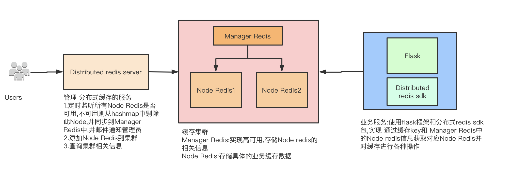

# 项目描述
* 使用一致性hash实现python flask版的分布式redis 客户端sdk包

# 项目主要功能
* 通过缓存key和从Manager Redis获取的 虚拟节点对应真实节点的dict 通过一致性hash算法找到对应的Node Redis,然后对此进行各种操作

# 项目优点
* 像平常一样使用redis,无需编写更多代码;如 get命令:DistributedRedisSdk().get('xxx');\
实现方法:通过分析redis包的Redis对象源码发现所有命令方法都通过调用 execute_command()执行命令;于是 通过继承Redis类,对execute_command()方法进行二次修改即可;
* 像flash_caching包一样进行缓存,因为此包 吸收了 flash_caching包 的Redis部分;
* 虚拟节点对应真实节点的dict 是直接从 Manager Redis获取,在高并发时只需对 Manager Redis 进行高可用处理即可

# 系统架构


# 测试
* 所需要的 节点redis 通过项目根目录的 docker-compose.yml 来生成

# 将来要实现功能
* 前端页面 对集群信息进行展示,对节点进行各种操作
* 添加测试用例

# 参数介绍
* DIS_MANAGER_REDIS_HOST:manager redis ip地址
* DIS_MANAGER_REDIS_PORT:manager redis 端口
* DIS_MANAGER_REDIS_PASSWORD:manager redis 密码,可以不设置
* DIS_MANAGER_REDIS_DB:manager redis 数据库
* DIS_CACHE_PREFIX:缓存前缀,用来区分项目;注意只对 memoize,cached 2个函数起作用
* DIS_CACHE_DEFAULT_TIMEOUT:缓存默认过期时间,可以不设置,默认300s

# 运行步骤
* 通过pip install 或 python setup.py 等方式安装此项目
* 在配置中设置相关参数
    ```
    class BaseConfig(object):
        DIS_MANAGER_REDIS_HOST = '127.0.0.1'
        DIS_MANAGER_REDIS_PORT = '6379'
        DIS_MANAGER_REDIS_PASSWORD = 'xxx'
        DIS_MANAGER_REDIS_DB = '13'
        DIS_CACHE_PREFIX = 'BEI:'
    ```
 
# 用法示例(详细请看examples和源码)
* 各种redis数据类型进行操作,以 string类型的get,set为例
    ```python3
    import DistributedRedisSdk
    redis = DistributedRedisSdk()
    redis.set('test',1)
    redis.get('test')
    ```
* 对函数进行缓存(入参不同,key不同,分配的node也不同)
    ```python3
    import DistributedRedisSdk
    redis = DistributedRedisSdk()
    
    # 缓存5秒
    @redis.memoize(5)
    def test(key, val):
        """
        测试缓存
        :param key:
        :param val:
        :return:
        """
        print('test func !!!!')
        return key + val + str(random.randint(1, 100))

    # 永久缓存
    @redis.memoize(-1)
    def test1(key, val):
        """
        测试缓存
        :param key:
        :param val:
        :return:
        """
        print('test func !!!!')
        return key + val + str(random.randint(1, 100))
    
    # 缓存设置的默认时长
    @redis.memoize()
    def test2(key, val):
        """
        测试缓存
        :param key:
        :param val:
        :return:
        """
        print('test func !!!!')
        return key + val + str(random.randint(1, 100))
    
    # 在类中的方法设置缓存(注意 只能是静态方法,其他方法因为 有 self,cls等 导致即使参数相同,但生成的key不同导致缓存失效)
    class TestController():
        @staticmethod
        @distributed_redis.memoize(5)
        def test(key, val):
            """
            测试缓存
            :param key:
            :param val:
            :return:
            """
            print('test func !!!!')
            return key + val + str(random.randint(1, 100))

    ```

# 注意点
* 此项目注意 配合 [一致性hash实现python flask版的分布式redis 的服务端](https://github.com/Rgcsh/distributed_redis_server.git) 包使用

# 使用技术
* python3.6,redis,一致性hash算法 ...

# 代码质量
* pylint
